# Sample Database Schema

PostgreSQL schema derived from JPA entities (`spring.jpa.hibernate.ddl-auto=update`).

Tables that extend `BaseModel` include: `id`, `name`, `description`, `remarks`, `created_at`, `updated_at`, `active`.

---

## Relationship overview

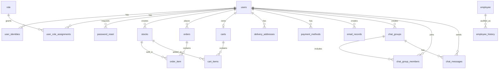

---

## 1. `users`

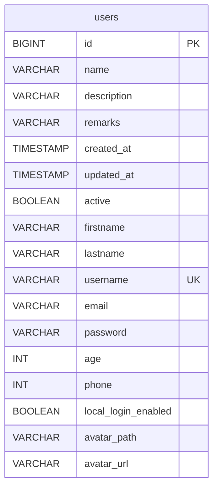

| Column | Type | Constraints |
|--------|------|-------------|
| `id` | `BIGINT` | PK, identity |
| `name` | `VARCHAR(255)` | nullable |
| `description` | `VARCHAR(255)` | nullable |
| `remarks` | `VARCHAR(255)` | nullable |
| `created_at` | `TIMESTAMP` | |
| `updated_at` | `TIMESTAMP` | |
| `active` | `BOOLEAN` | default `true` |
| `firstname` | `VARCHAR(255)` | not null |
| `lastname` | `VARCHAR(255)` | not null |
| `username` | `VARCHAR(255)` | not null, unique |
| `email` | `VARCHAR(255)` | not null |
| `password` | `VARCHAR(255)` | nullable |
| `age` | `INT` | nullable |
| `phone` | `INT` | nullable |
| `local_login_enabled` | `BOOLEAN` | not null, default `false` |
| `avatar_path` | `VARCHAR(512)` | nullable |
| `avatar_url` | `VARCHAR(1024)` | nullable |

---

## 2. `user_identities`

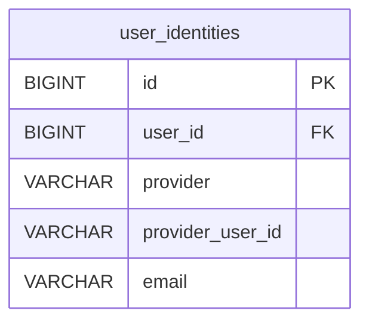

| Column | Type | Constraints |
|--------|------|-------------|
| `id` | `BIGINT` | PK, identity |
| `user_id` | `BIGINT` | FK → `users.id`, not null |
| `provider` | `VARCHAR(32)` | not null |
| `provider_user_id` | `VARCHAR(255)` | not null |
| `email` | `VARCHAR(255)` | nullable |

Unique: `(provider, provider_user_id)`

---

## 3. `role`

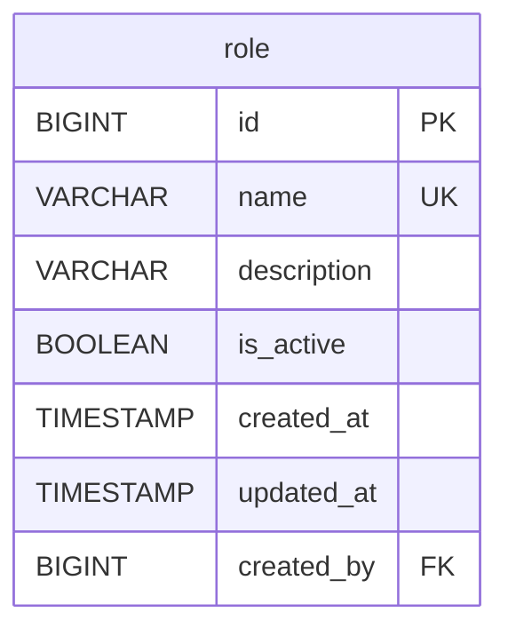

| Column | Type | Constraints |
|--------|------|-------------|
| `id` | `BIGINT` | PK, identity |
| `name` | `VARCHAR(255)` | not null, unique (`ROLE_USER`, `ROLE_ADMIN`) |
| `description` | `VARCHAR(255)` | not null |
| `is_active` | `BOOLEAN` | not null, default `true` |
| `created_at` | `TIMESTAMP` | |
| `updated_at` | `TIMESTAMP` | |
| `created_by` | `BIGINT` | FK → `users.id`, nullable |

---

## 4. `user_role_assignments`

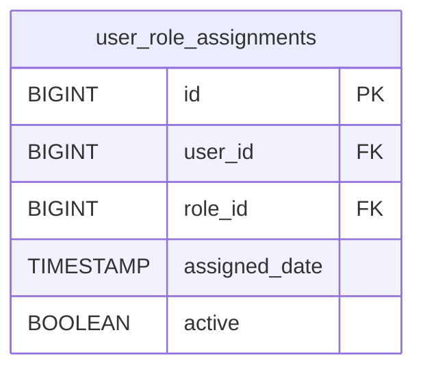

| Column | Type | Constraints |
|--------|------|-------------|
| `id` | `BIGINT` | PK, identity |
| `user_id` | `BIGINT` | FK → `users.id`, not null |
| `role_id` | `BIGINT` | FK → `role.id`, not null |
| `assigned_date` | `TIMESTAMP` | not null |
| `active` | `BOOLEAN` | not null |

---

## 5. `password_reset`

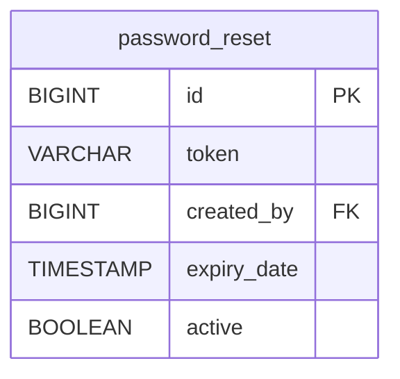

| Column | Type | Constraints |
|--------|------|-------------|
| `id` | `BIGINT` | PK, identity |
| `token` | `VARCHAR(255)` | nullable |
| `created_by` | `BIGINT` | FK → `users.id` |
| `expiry_date` | `TIMESTAMP` | nullable |
| `active` | `BOOLEAN` | not null, default `true` |

---

## 6. `employee`

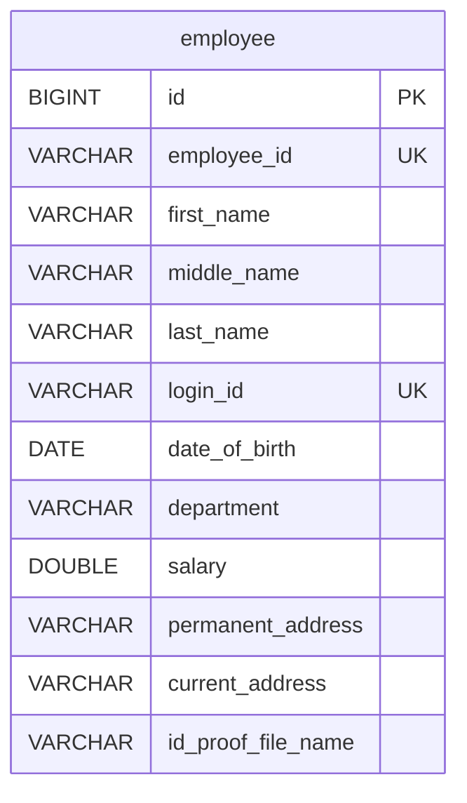

| Column | Type | Constraints |
|--------|------|-------------|
| `id` | `BIGINT` | PK, identity |
| `employee_id` | `VARCHAR(255)` | unique |
| `first_name` | `VARCHAR(255)` | not null |
| `middle_name` | `VARCHAR(255)` | nullable |
| `last_name` | `VARCHAR(255)` | not null |
| `login_id` | `VARCHAR(255)` | unique |
| `date_of_birth` | `DATE` | nullable |
| `department` | `VARCHAR(255)` | nullable |
| `salary` | `DOUBLE PRECISION` | nullable |
| `permanent_address` | `VARCHAR(255)` | nullable |
| `current_address` | `VARCHAR(255)` | nullable |
| `id_proof_file_name` | `VARCHAR(255)` | nullable |

---

## 7. `employee_history`

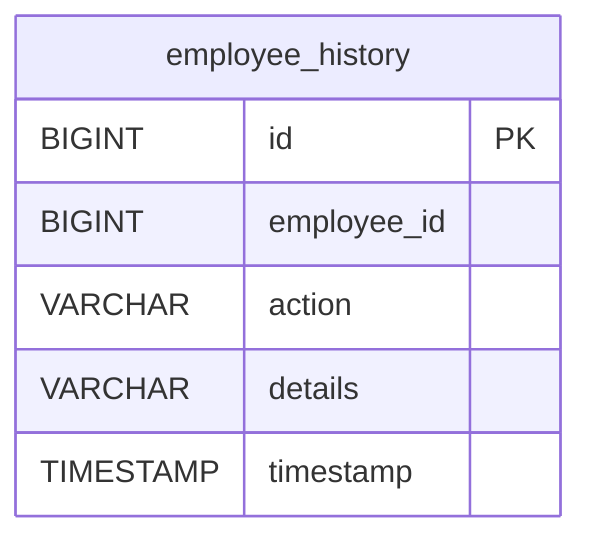

| Column | Type | Constraints |
|--------|------|-------------|
| `id` | `BIGINT` | PK, identity |
| `employee_id` | `BIGINT` | logical ref to employee |
| `action` | `VARCHAR(255)` | nullable |
| `details` | `VARCHAR(255)` | nullable |
| `timestamp` | `TIMESTAMP` | nullable |

---

## 8. `stocks`

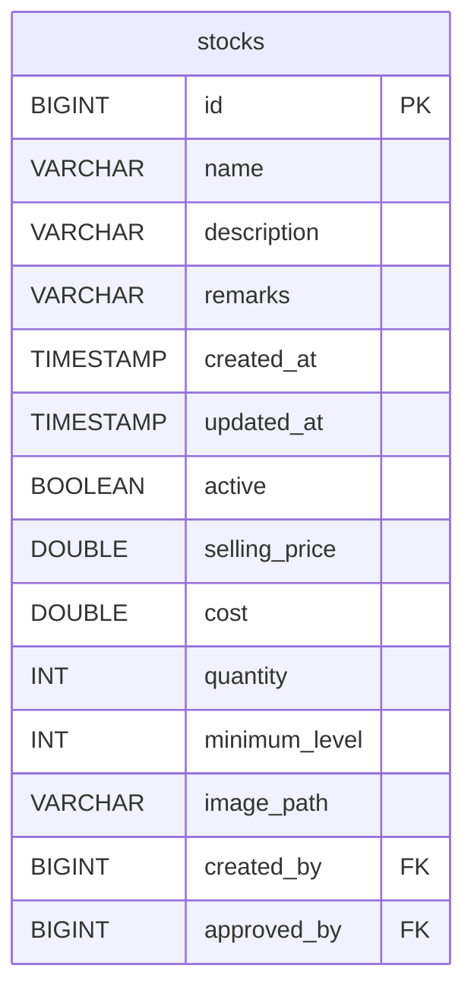

| Column | Type | Constraints |
|--------|------|-------------|
| `id` | `BIGINT` | PK, identity |
| `name` | `VARCHAR(255)` | nullable |
| `description` | `VARCHAR(255)` | nullable |
| `remarks` | `VARCHAR(255)` | nullable |
| `created_at` | `TIMESTAMP` | |
| `updated_at` | `TIMESTAMP` | |
| `active` | `BOOLEAN` | default `true` |
| `selling_price` | `DOUBLE PRECISION` | not null |
| `cost` | `DOUBLE PRECISION` | nullable |
| `quantity` | `INT` | nullable |
| `minimum_level` | `INT` | nullable |
| `image_path` | `VARCHAR(255)` | nullable |
| `created_by` | `BIGINT` | FK → `users.id`, not null |
| `approved_by` | `BIGINT` | FK → `users.id`, nullable |

---

## 9. `orders`

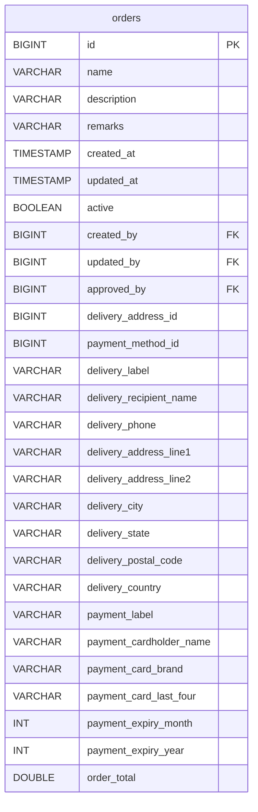

| Column | Type | Constraints |
|--------|------|-------------|
| `id` | `BIGINT` | PK, identity |
| BaseModel fields | | `name`, `description`, `remarks`, `created_at`, `updated_at`, `active` |
| `created_by` | `BIGINT` | FK → `users.id`, not null |
| `updated_by` | `BIGINT` | FK → `users.id`, nullable |
| `approved_by` | `BIGINT` | FK → `users.id`, nullable |
| `delivery_address_id` | `BIGINT` | nullable snapshot ref |
| `payment_method_id` | `BIGINT` | nullable snapshot ref |
| `delivery_*` | various | delivery address snapshot |
| `payment_*` | various | payment method snapshot |
| `order_total` | `DOUBLE PRECISION` | not null, default `0` |

---

## 10. `order_item`

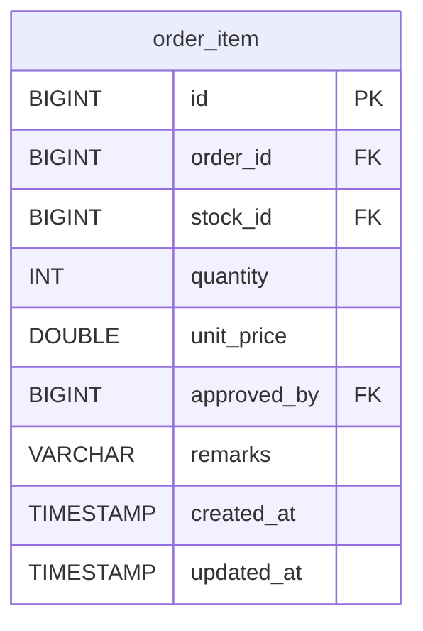

| Column | Type | Constraints |
|--------|------|-------------|
| `id` | `BIGINT` | PK, identity |
| `order_id` | `BIGINT` | FK → `orders.id`, not null |
| `stock_id` | `BIGINT` | FK → `stocks.id`, not null |
| `quantity` | `INT` | not null |
| `unit_price` | `DOUBLE PRECISION` | not null, default `0` |
| `approved_by` | `BIGINT` | FK → `users.id`, nullable |
| `remarks` | `VARCHAR(255)` | nullable |
| `created_at` | `TIMESTAMP` | |
| `updated_at` | `TIMESTAMP` | |

---

## 11. `carts`

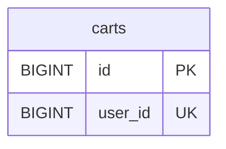

| Column | Type | Constraints |
|--------|------|-------------|
| `id` | `BIGINT` | PK, identity |
| `user_id` | `BIGINT` | not null, unique |

---

## 12. `cart_items`

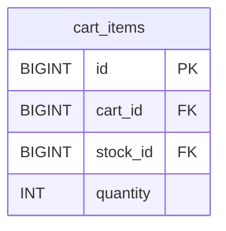

| Column | Type | Constraints |
|--------|------|-------------|
| `id` | `BIGINT` | PK, identity |
| `cart_id` | `BIGINT` | FK → `carts.id`, not null |
| `stock_id` | `BIGINT` | FK → `stocks.id`, not null |
| `quantity` | `INT` | not null |

---

## 13. `delivery_addresses`

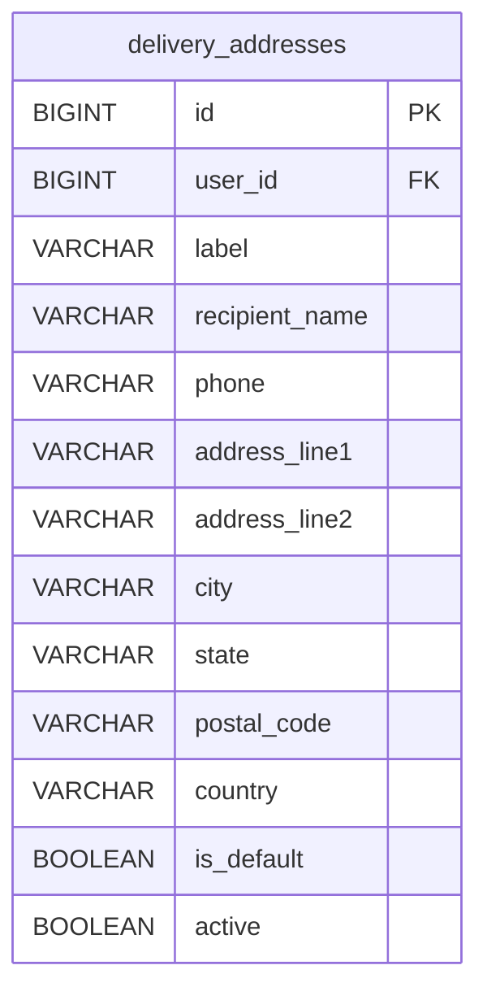

| Column | Type | Constraints |
|--------|------|-------------|
| `id` | `BIGINT` | PK, identity |
| `user_id` | `BIGINT` | FK → `users.id`, not null |
| `label` | `VARCHAR(100)` | not null |
| `recipient_name` | `VARCHAR(120)` | not null |
| `phone` | `VARCHAR(32)` | nullable |
| `address_line1` | `VARCHAR(255)` | not null |
| `address_line2` | `VARCHAR(255)` | nullable |
| `city` | `VARCHAR(100)` | not null |
| `state` | `VARCHAR(100)` | nullable |
| `postal_code` | `VARCHAR(32)` | not null |
| `country` | `VARCHAR(100)` | not null |
| `is_default` | `BOOLEAN` | not null |
| `active` | `BOOLEAN` | not null |

---

## 14. `payment_methods`

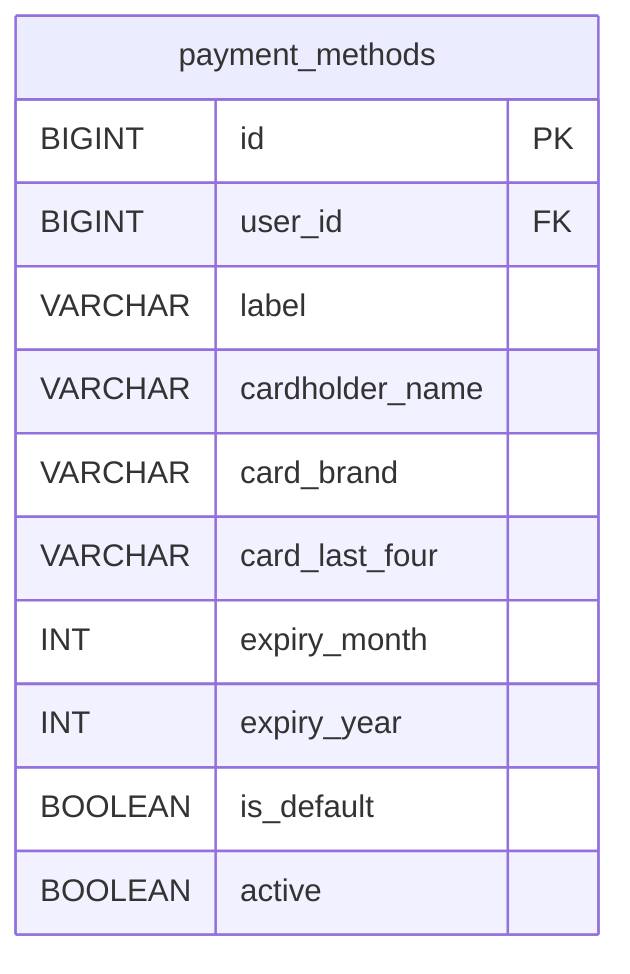

| Column | Type | Constraints |
|--------|------|-------------|
| `id` | `BIGINT` | PK, identity |
| `user_id` | `BIGINT` | FK → `users.id`, not null |
| `label` | `VARCHAR(100)` | not null |
| `cardholder_name` | `VARCHAR(120)` | not null |
| `card_brand` | `VARCHAR(32)` | not null |
| `card_last_four` | `VARCHAR(4)` | not null |
| `expiry_month` | `INT` | not null |
| `expiry_year` | `INT` | not null |
| `is_default` | `BOOLEAN` | not null |
| `active` | `BOOLEAN` | not null |

---

## 15. `email_records`

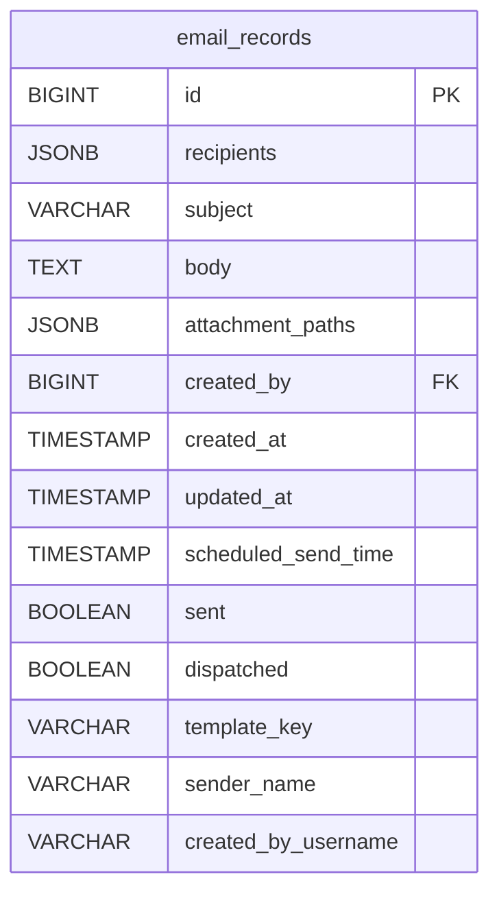

| Column | Type | Constraints |
|--------|------|-------------|
| `id` | `BIGINT` | PK, identity |
| `recipients` | `JSONB` | not null |
| `subject` | `VARCHAR(255)` | nullable |
| `body` | `TEXT` | nullable |
| `attachment_paths` | `JSONB` | not null |
| `created_by` | `BIGINT` | FK → `users.id`, nullable |
| `created_at` | `TIMESTAMP` | |
| `updated_at` | `TIMESTAMP` | |
| `scheduled_send_time` | `TIMESTAMP` | nullable |
| `sent` | `BOOLEAN` | default `false` |
| `dispatched` | `BOOLEAN` | not null, default `false` |
| `template_key` | `VARCHAR(255)` | nullable |
| `sender_name` | `VARCHAR(255)` | nullable |
| `created_by_username` | `VARCHAR(255)` | nullable |

---

## 16. `email_templates`

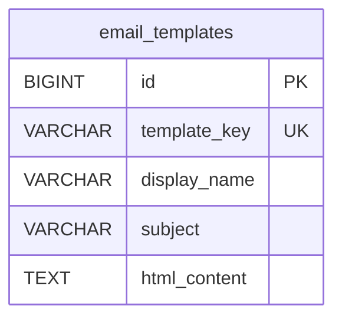

| Column | Type | Constraints |
|--------|------|-------------|
| `id` | `BIGINT` | PK, identity |
| `template_key` | `VARCHAR(255)` | not null, unique |
| `display_name` | `VARCHAR(255)` | not null |
| `subject` | `VARCHAR(255)` | not null |
| `html_content` | `TEXT` | not null |

---

## 17. `chat_groups`

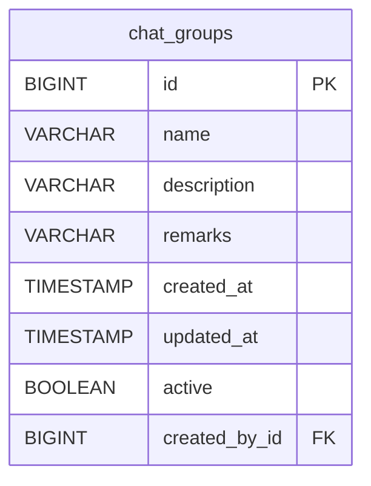

| Column | Type | Constraints |
|--------|------|-------------|
| `id` | `BIGINT` | PK, identity |
| BaseModel fields | | `name`, `description`, `remarks`, `created_at`, `updated_at`, `active` |
| `created_by_id` | `BIGINT` | FK → `users.id`, not null |

---

## 18. `chat_group_members`

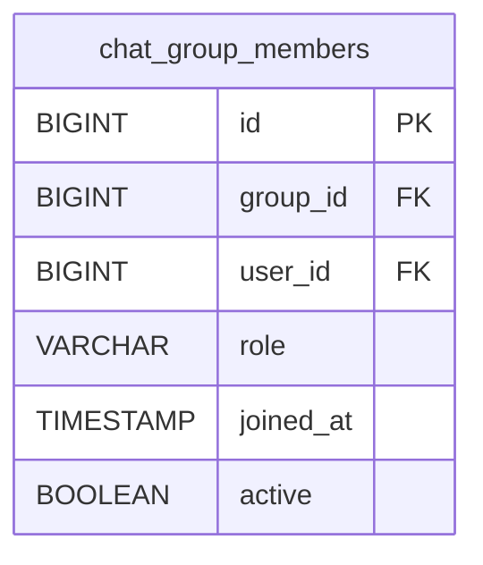

| Column | Type | Constraints |
|--------|------|-------------|
| `id` | `BIGINT` | PK, identity |
| `group_id` | `BIGINT` | FK → `chat_groups.id`, not null |
| `user_id` | `BIGINT` | FK → `users.id`, not null |
| `role` | `VARCHAR(16)` | not null (`LEADER`, `MEMBER`) |
| `joined_at` | `TIMESTAMP` | not null |
| `active` | `BOOLEAN` | not null |

Unique: `(group_id, user_id)`

---

## 19. `chat_messages`


| Column | Type | Constraints |
|--------|------|-------------|
| `id` | `BIGINT` | PK, identity |
| `group_id` | `BIGINT` | FK → `chat_groups.id`, not null |
| `sender_id` | `BIGINT` | FK → `users.id`, not null |
| `content` | `VARCHAR(4000)` | not null |
| `sent_at` | `TIMESTAMP` | not null |

---

## 20. `log_events`

```mermaid
erDiagram
    log_events {
        BIGINT id PK
        VARCHAR username
        VARCHAR path
        VARCHAR http_method
        TIMESTAMP logged_in_at
        TIMESTAMP duration
    }
```

| Column | Type | Constraints |
|--------|------|-------------|
| `id` | `BIGINT` | PK, identity |
| `username` | `VARCHAR(255)` | not null |
| `path` | `VARCHAR(255)` | not null |
| `http_method` | `VARCHAR(255)` | not null |
| `logged_in_at` | `TIMESTAMP` | not null |
| `duration` | `TIMESTAMP` | nullable (`Instant`) |

---

## 21. `app_settings`

```mermaid
erDiagram
    app_settings {
        BIGINT id PK
        VARCHAR setting_key UK
        VARCHAR setting_value
    }
```

| Column | Type | Constraints |
|--------|------|-------------|
| `id` | `BIGINT` | PK, identity |
| `setting_key` | `VARCHAR(255)` | not null, unique |
| `setting_value` | `VARCHAR(255)` | not null |

---

## 22. `student`

```mermaid
erDiagram
    student {
        BIGINT id PK
        VARCHAR first_name
        VARCHAR last_name
    }
```

| Column | Type | Constraints |
|--------|------|-------------|
| `id` | `BIGINT` | PK |
| `first_name` | `VARCHAR(255)` | not null |
| `last_name` | `VARCHAR(255)` | not null |
