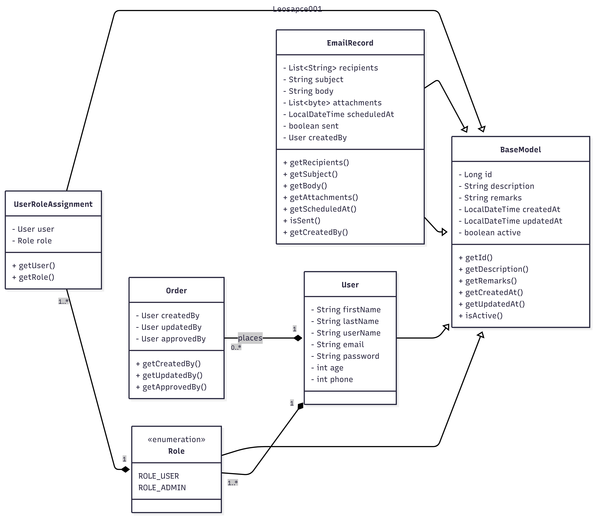
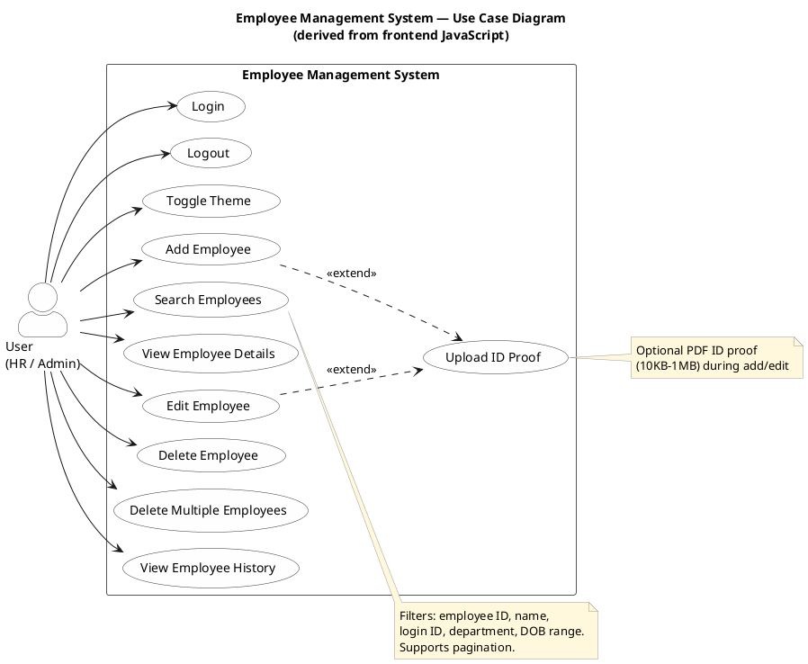

### Clone the project from github
```
git clone https://github.com/Leospace001/AY2526-FYP-B05.git
```

### Run the project in docker container
```
docker compose up -d
```

### Adminer (Access to Postgresql Database)
```
http://localhost:7070/
server:     db
username:   postgres
password:   postgres
```

### Website frontend (Admin account)
```
https://leospace.cc/
username:   admin
password:   P@ssw0rd
```
